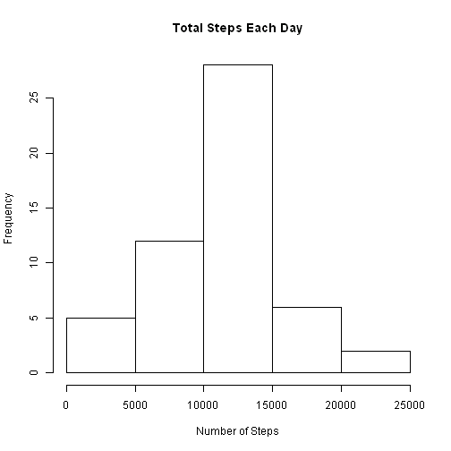
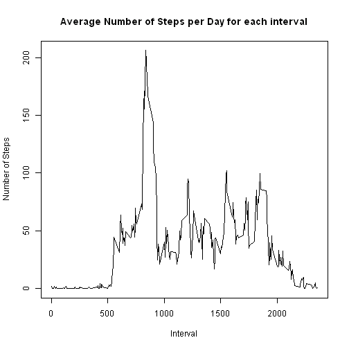

## Loading and preprocessing the data
Unzip and read the csv file.

```r
unzip("activity.zip ")
data <- read.csv("activity.csv")
```


## What is mean total number of steps taken per day?
**Histogram of total steps each day**

```r
stepsByDay <- aggregate(steps~date, data, sum)
hist(stepsByDay$steps, main = paste("Total Steps Each Day"), xlab="Number of Steps")
```

 

**Mean and Median of total steps taken each day**

```r
mean(stepsByDay$steps)
```

```
## [1] 10766.19
```

```r
median(stepsByDay$steps)
```

```
## [1] 10765
```


## What is the average daily activity pattern?
**Time series plot of the 5-minute interval (x-axis) and the average number of steps taken, averaged across all days (y-axis)**

```r
stepsByInterval <- aggregate(steps~interval, data, mean)
plot(stepsByInterval$interval, stepsByInterval$steps, type="l", xlab="Interval", ylab="Number of Steps",main="Average Number of Steps per Day for each interval")
```

 

**5 minute interval with the most steps based on the average across all days**

```r
stepsByInterval[which.max(stepsByInterval$steps),1]
```

```
## [1] 835
```


## Imputing missing values
**Total number of missing values in the dataset**

```r
sum(!complete.cases(data))
```

```
## [1] 2304
```

**A new data set with NAs replaced by  averages for  that time interval across all days is created**

```r
moddata <- transform(data, steps = ifelse(is.na(data$steps), stepsByInterval$steps[match(data$interval, stepsByInterval$interval)], data$steps))
```

**Histogram of total steps each day - for the new dataset**

```r
modStepsByDay <- aggregate(steps~date, moddata, sum)
hist(modStepsByDay$steps, main = paste("Total Steps Each Day"), xlab="Number of Steps")
```

 

**Mean and Median of total steps taken each day - for the new dataset**

```r
mean(modStepsByDay$steps)
```

```
## [1] 10766.19
```

```r
median(modStepsByDay$steps)
```

```
## [1] 10766.19
```

**Differences in Mean, Median and Total between the modified data set and the original data set**

```r
mean(modStepsByDay$steps) - mean(stepsByDay$steps)
```

```
## [1] 0
```

```r
median(modStepsByDay$steps) - median(stepsByDay$steps)
```

```
## [1] 1.188679
```

```r
sum(modStepsByDay$steps) - sum(stepsByDay$steps)
```

```
## [1] 86129.51
```

**Comparison histogram of total steps each day - Modified vs Original data sets**

```r
hist(modStepsByDay$steps, main = paste("Total Steps Each Day"), col="blue", xlab="Number of Steps")
hist(stepsByDay$steps, main = paste("Total Steps Each Day"), col="red", xlab="Number of Steps", add=T)
legend("topright", c("Modified", "Original"), col=c("blue", "red"), lwd=10)
```

 


## Are there differences in activity patterns between weekdays and weekends?
1. Created a new factor variable in the dataset with two levels -- "weekday" and "weekend" indicating whether a given date is a weekday or weekend day.

```r
weekdays <- c("Monday", "Tuesday", "Wednesday", "Thursday", "Friday")
moddata$daytype = as.factor(ifelse(is.element(weekdays(as.Date(moddata$date)),weekdays), "Weekday", "Weekend"))
modStepsByInterval <- aggregate(steps ~ interval + daytype, moddata, mean)
```

2. Comparison plot containing a time series plot of the 5-minute interval (x-axis) and the average number of steps taken, averaged across all weekday days or weekend days (y-axis). 

```r
library(lattice)
xyplot(modStepsByInterval$steps ~ modStepsByInterval$interval|modStepsByInterval$daytype, main="Average Steps per Day for each interval", xlab="Interval", ylab="Steps", layout=c(1,2), type="l")
```

 
